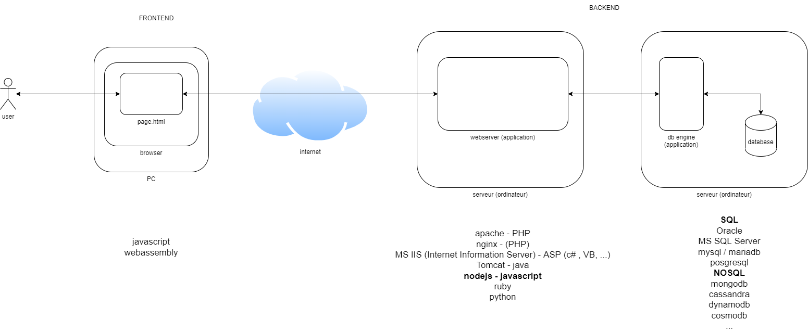

# quick start express#

## architecture web ##
Voici un exemple classique d'architecture web



## creation du projet ##

```
npm init
```
ce qui crée le fichier package.json, par example:
```json
{
  "name": "codeapp",
  "version": "1.0.0",
  "description": "",
  "main": "server.js",
  "scripts": {
    "test": "echo \"Error: no test specified\" && exit 1"
  },
  "author": "",
  "license": "ISC",
  "dependencies": {
    "express": "^4.17.2"
  }
}
```

## download d'express ##

```
npm i express --save
```

Voir [installation d'express](https://expressjs.com/fr/starter/installing.html).

## écrire l'application express ##
Nous avons créer le fichier server.js:
```javascript
const express = require('express');
const app = express();
const port = 3001;

app.get('/*', (request, response) => {
    response.send('Hello Express World!');
});

app.listen(port, () => {
    console.log(`prêt sur le http://localhost:${port}`);
});
```

Voir [express Hello world](https://expressjs.com/fr/starter/hello-world.html) et le code sur github [express-app](https://github.com/jedepaepe/javascript-examples/tree/main/lesson-18-expressjs/express-app).

## écrire un serveur web statique avec express ##
Nous codons le fichier server.js (ou autre):
```javascript
const express = require('express');
const app = express();
const port = 3000;

app.use(express.static('public'));

app.listen(port, () => {
    console.log(`ready http://localhost:${port}`);
});
```

Voir [express fichiers statiques](https://expressjs.com/fr/starter/static-files.html)
et le code sur github [static-server](https://github.com/jedepaepe/javascript-examples/tree/main/lesson-18-expressjs/static-server).